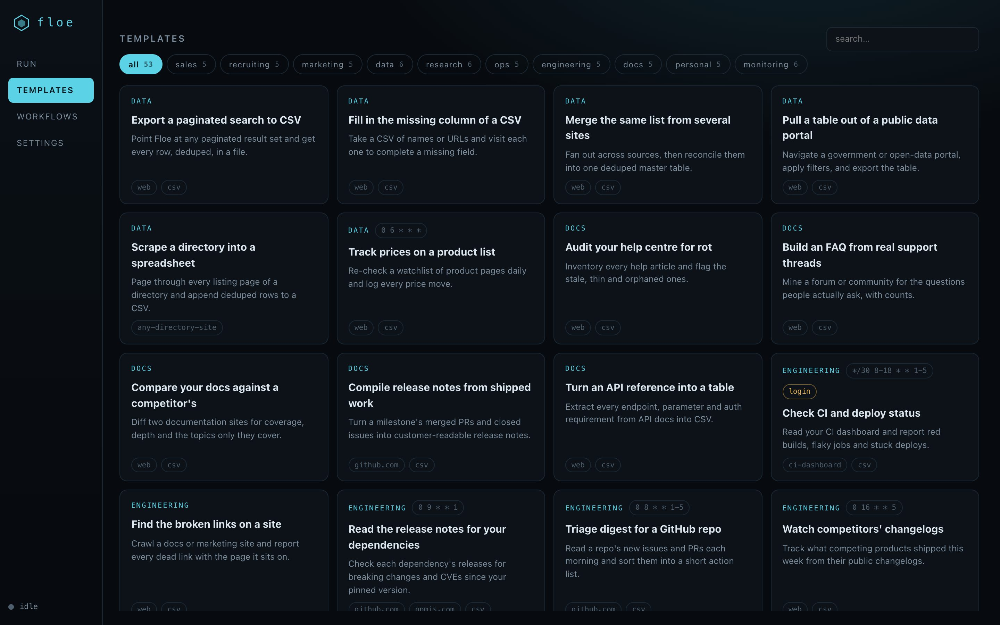
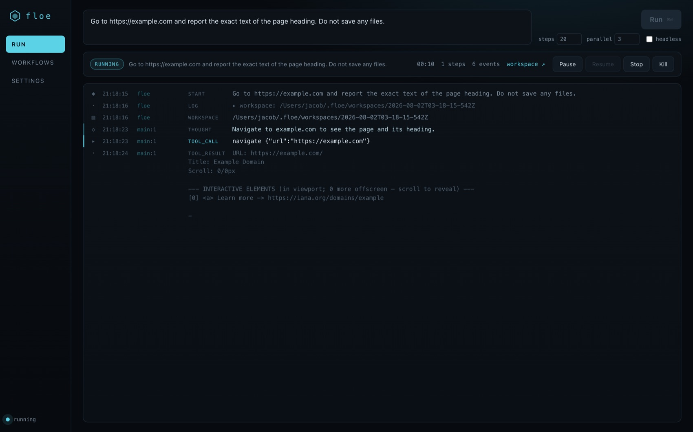
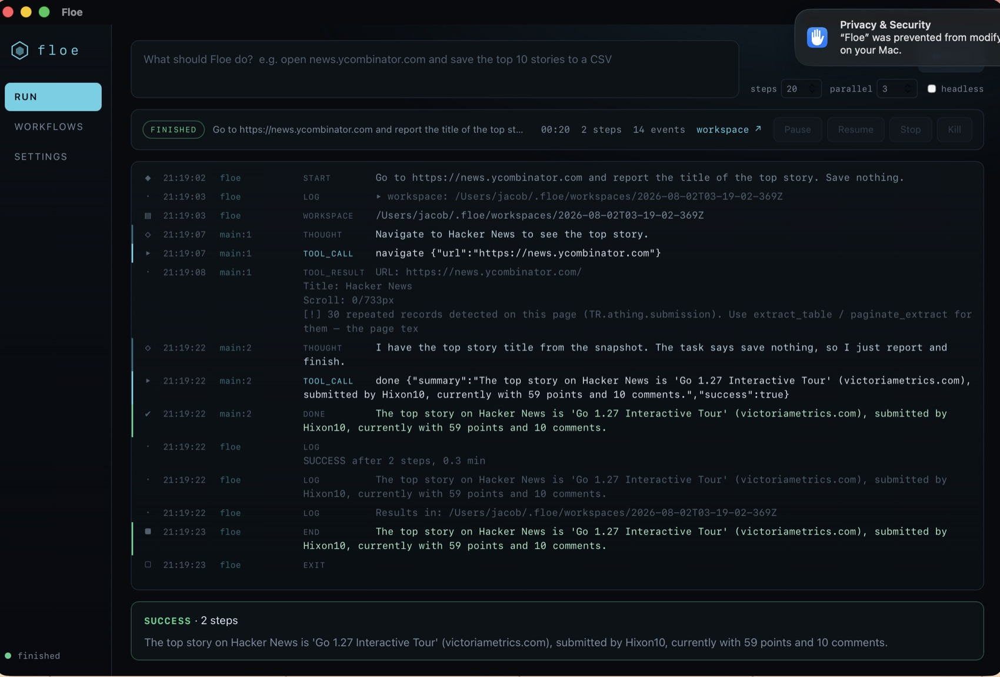
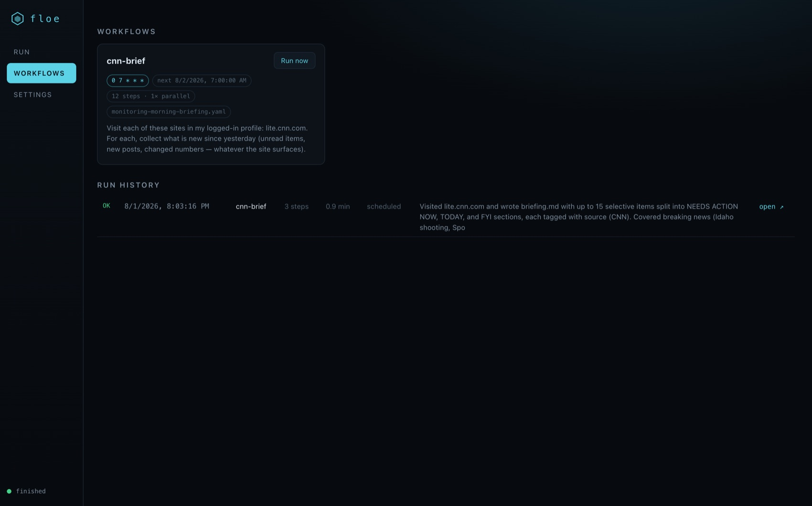
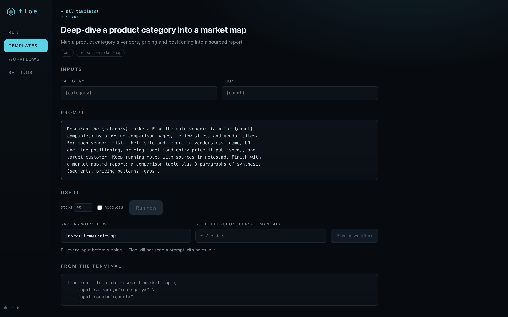
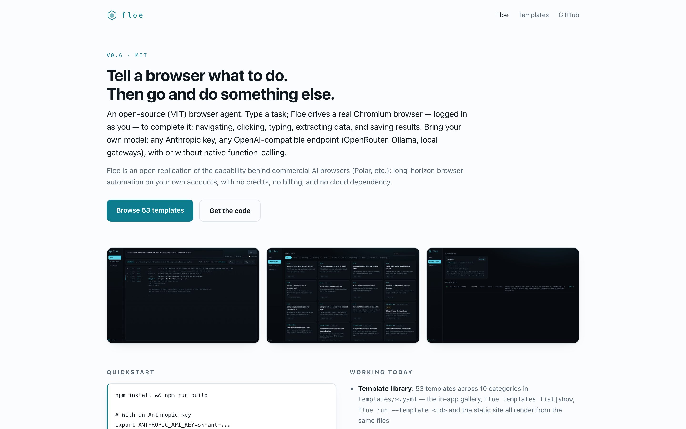
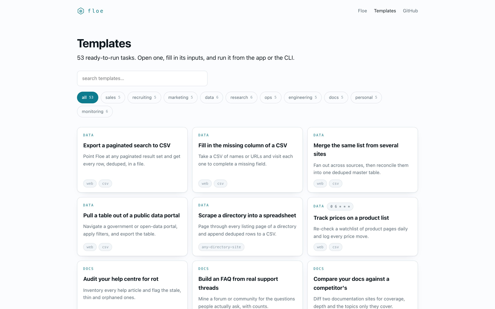

# Floe

**An open-source (MIT) browser agent.** Type a task; Floe drives a real Chromium browser — logged in as you — to complete it: navigating, clicking, typing, extracting data, and saving results. Bring your own model: any Anthropic key, any OpenAI-compatible endpoint (OpenRouter, Ollama, local gateways), with or without native function-calling.

Floe is an open replication of the capability behind commercial AI browsers (Polar, etc.): long-horizon browser automation on your own accounts, with no credits, no billing, and no cloud dependency.

## Status: v0.6 — engine + desktop app + template library (early)

**What's new in v0.6** — 53 templates, one source of truth. Every template is a plain YAML file in `templates/` — name, description, category, integrations, `requires_login`, optional cron default, `{placeholder}` inputs and the prompt itself — and that single file feeds the CLI (`floe templates list|show`, `floe run --template <id>`), the app's **Templates** tab (filterable grid → detail view with live-substituted prompt, *Run now* / *Save as workflow*) and the generated static site (`npm run site` → `site/dist`, zero dependencies, no CDN, light and dark). `npm test` lints the library: schema fields, category in the fixed set, every `{placeholder}` declared as an input *and* every input used, cron expressions that actually parse, unique names, filename convention. The prompts are written to Floe's strengths — `paginate_extract` for lists, `spawn_agents` for multi-site fan-out, incremental CSV appends, and an explicit "say what you could not get" clause so a template reports its gaps instead of padding them.



**v0.5** — Floe has a face, and a protocol behind it. `floe events-run "<task>"` runs an agent headlessly and emits **every event as JSONL on stdout** while accepting `{"cmd":"pause"|"resume"|"stop"|"kill"}` on stdin — the seam the app talks to, and a stable API for anyone embedding Floe in their own tool. Pause and stop are honest: pause blocks *between* steps (never mid-click), and stop is a graceful wrap-up (the agent is told to save and call `done`), not a kill. On top of it sits the desktop app — command bar, streaming timeline, pause/resume/stop/kill, a workflows tab with schedules + run history, and a settings tab that writes `~/.floe/config.json`, which the CLI reads too (env vars still win), so you never have to export `FLOE_*` by hand again.



**v0.4** — Floe runs while you sleep. Save any task (or any `templates/*.yaml`, with `{placeholder}` inputs) as a named workflow, give it a cron schedule, and a scheduler daemon fires it: `floe workflow save morning-brief --template templates/monitoring-morning-briefing.yaml --input sites=lite.cnn.com --schedule "0 7 * * *"`. The cron parser is ~130 lines in-engine (no dependency): `*`, numbers, `a-b`, `*/n`, lists, the vixie day-of-month-**or**-day-of-week rule, and loud rejection of bad expressions at *save* time rather than at 7am. Runs land in `~/.floe/workspaces/<name>/<timestamp>/` and append a line to `~/.floe/history.jsonl` (`floe history`). Sleep resilience is native: a slot missed while the Mac was asleep is served **once** on the next start if it's less than 24h old — one rule ("has the most recent slot been served?") covers both normal firing and catch-up, and the slot is claimed *before* the run so a crash can't become a run loop. `floe schedule install` writes a `com.floe.scheduler` LaunchAgent (absolute node path, provider env baked in, log at `~/.floe/logs/scheduler.log`).

**v0.3** — Floe stopped being one agent in one tab. Every agent now owns its own `BrowserSession` (its own window/tabs), and an orchestrator can `spawn_agents` to run N executors **in parallel** — each with its own task, its own window, and a cheap model lane — coordinating through the shared task workspace. Live over a local gateway: three executors researched lite.cnn.com, text.npr.org and news.ycombinator.com **concurrently** (overlapping timestamps in one log), wrote three CSVs, and the orchestrator merged them into a briefing. Long runs got serious too: provider calls retry with exponential backoff (5s/20s/60s on network errors, 429, 5xx and overload envelopes), and `--max-minutes` ends a run by *telling the agent to wrap up and save*, never by killing it mid-write.

**v0.2** — extraction stopped being the model's job. `extract_table` finds the page's dominant repeated structure (a regular table, or listing cards / feed items / search results, segmented by repeated markers) with pure DOM heuristics, and `paginate_extract` walks pagination writing deduped rows straight to a CSV in code. On the Hacker News 3-page benchmark that took the run from 15 steps of hand-transcribed rows to **4 steps, 90 rows, zero duplicates**. Element ids are also sticky now, so an id stays glued to its element across snapshots instead of being reassigned from 0 (the stale-click bug in v0.1).

Working today:
- **Template library**: 53 templates across 10 categories in `templates/*.yaml` — the in-app gallery, `floe templates list|show`, `floe run --template <id>` and the static site all render from the same files
- **Desktop app**: command bar, live event timeline, pause/resume/stop/kill, workflows + run history, settings (`floe ui`, or the Tauri window)
- **Headless runner protocol**: `floe events-run` / `floe events-workflow` — JSONL events out, control commands in
- Persistent Chromium profile (log in once; sessions persist across tasks)
- **Saved workflows + cron scheduler**: `floe workflow save/list/show/rm/run`, `floe schedule` (daemon or `--once`), `floe history`; per-run workspaces, a JSONL run log, and a `com.floe.scheduler` LaunchAgent for macOS
- **Parallel subagents**: `spawn_agents` launches 1–N executors, each owning a browser session and running the full agent loop; results come back as done-summaries plus files in the shared workspace (each executor is namespaced to its own `<name>-*` files)
- **Multi-model lanes**: `FLOE_MODEL` plans, `FLOE_EXECUTOR_MODEL` (cheap lane, e.g. haiku) does the page work
- **Long-run resilience**: provider retry with exponential backoff + a soft wall-clock budget (`--max-minutes`) that asks the agent to wrap up and save instead of killing it
- Agent loop with indexed-element page snapshots (a11y-style: numbered interactive elements + page text), with **stable element ids** across re-renders
- Structured extraction with no model call: `extract_table` (tables + repeated cards), `paginate_extract` (multi-page scrape → CSV, code-side dedupe on a key column, auto "next"/"more"/infinite-scroll advance)
- Tools: navigate, read_page, click, type_text, press_key, scroll, tabs (scoped to the agent's own session), extract_table, paginate_extract, workspace files, spawn_agents (orchestrator only), done
- Per-task workspace (notes, incremental CSVs) so long tasks survive interruptions
- Providers: Anthropic Messages API, any OpenAI-compatible endpoint, and a **prompt-protocol tool mode** (`FLOE_TOOL_MODE=prompt`) that gets tool-calling out of endpoints with no function-calling support
- Context trimming of stale snapshots so multi-hour tasks don't blow the window

## Quickstart

```bash
npm install && npm run build

# With an Anthropic key
export ANTHROPIC_API_KEY=sk-ant-...
node packages/cli/dist/main.js run "Go to news.ycombinator.com and save the top 5 stories to results.csv"

# With any OpenAI-compatible endpoint (Ollama, OpenRouter, local gateway)
export FLOE_PROVIDER=openai FLOE_BASE_URL=http://127.0.0.1:11434 FLOE_MODEL=qwen3:8b
node packages/cli/dist/main.js run "..." 

# Endpoint has no function-calling? Use the prompt protocol:
export FLOE_TOOL_MODE=prompt

# Parallel research with a cheap executor lane and a time budget
export FLOE_EXECUTOR_MODEL=haiku
node packages/cli/dist/main.js run "Spawn agents for lite.cnn.com, text.npr.org and news.ycombinator.com in parallel; \
  each saves its top 10 headlines to its own CSV; then merge them into briefing.md" --parallel 3 --max-minutes 30
```

## The desktop app

```bash
npm install && npm run build     # builds engine, CLI and the app bundle
floe ui                          # → http://127.0.0.1:4321, opens your browser

# native window (macOS .app, needs the Rust toolchain):
npm --workspace @floe/app run tauri build
open "packages/app/src-tauri/target/release/bundle/macos/Floe.app"
```

Both shells are the same app. The Tauri shell is deliberately thin — ~110 lines of Rust that start `floe ui` as a child process and point a webview at it — so there is exactly one frontend, one API, and no chance of the two drifting apart. If you don't have Rust, `floe ui` is the whole product in a browser tab.



*The native window, mid-task. It finds your `node` even though a GUI app inherits launchd's bare `PATH`, and reads provider settings from `~/.floe/config.json` — a run launched from Finder with **no environment at all** works. (An unsigned dev build also draws a "prevented from modifying apps" notice from macOS App Management the first time it launches Chrome; it is cosmetic and blocks nothing. Code signing removes it.)*

| | |
|---|---|
|  |  |

- **Command bar** — type a task, ⌘⏎ to run. Chrome opens beside the app and you watch it work.
- **Timeline** — every thought, tool call, tool result, and error, agent-tagged (`main`, or the executor's name when a task fans out), auto-scrolling until you scroll up.
- **Controls** — Pause (takes effect between steps), Resume, Stop (graceful: the agent saves and summarises), Kill (immediate; closes Chrome).
- **Workflows** — saved workflows with their cron schedule and next fire time, a run-now button, and the run history from `history.jsonl` with a link that reveals each run's workspace in Finder.
- **Settings** — provider, models, tool mode, base URL and keys, written to `~/.floe/config.json` (mode 600). The CLI applies that file at startup, and any `FLOE_*` environment variable overrides it.

### Runner protocol (the embedding API)

```bash
floe events-run "Save the top 10 HN stories to top.csv" --max-steps 20
# stdout, one JSON object per line:
{"ts":…,"ev":"start","task":"…"}
{"ts":…,"ev":"workspace","dir":"/Users/you/.floe/workspaces/…"}
{"ts":…,"ev":"thought","agent":"main","step":1,"detail":"…"}
{"ts":…,"ev":"tool_call","agent":"main","step":1,"detail":"navigate {\"url\":…}"}
{"ts":…,"ev":"end","success":true,"steps":6,"summary":"…","workspace":"…"}

# stdin, one command per line:
{"cmd":"pause"}   # blocks before the next step; emits ev:"paused"
{"cmd":"resume"}
{"cmd":"stop"}    # graceful: injects "save your work and call done"
{"cmd":"kill"}    # closes the browser and exits 137
```

`floe events-workflow <name>` does the same for a saved workflow and writes its history line. Anything that can spawn a process and read lines can drive Floe — that includes the two shells here, and it is the intended way to embed the engine.

## Templates

`templates/` holds 53 ready-to-run tasks across ten categories — sales, recruiting, marketing, data, research, ops, engineering, docs, personal, monitoring. Each is one YAML file, and it is the only copy: the CLI, the app's gallery and the generated site all render from it.

```yaml
name: Export a paginated search to CSV
category: data
description: Point Floe at any paginated result set and get every row, deduped, in a file.
integrations: [web, csv]
requires_login: []          # domains the run needs you already logged into
schedule: null              # a cron default, for templates that want to run themselves
inputs:
  - results_url
  - key_column
  - max_pages
prompt: |
  Export the results at {results_url}. …
```

```bash
floe templates list                     # the whole library, grouped by category
floe templates list --category research
floe templates show data-price-tracker  # full prompt, inputs, and the commands to run it

floe run --template data-paginated-search-export \
  --input results_url=https://quotes.toscrape.com/ --input key_column=quote --input max_pages=3

# or save it as a scheduled workflow
floe workflow save quotes --template data-paginated-search-export \
  --input results_url=... --input key_column=quote --input max_pages=3 --schedule "0 7 * * *"
```

In the app, the **Templates** tab is the same library: filter by category or search, open one, fill its inputs (the prompt preview substitutes them as you type), then *Run now* or *Save as workflow* with a schedule.



**Templates that need an account** are marked `requires_login` and carry a `login` badge — they read the site through your own logged-in `~/.floe/profile`, so log in there once first. They are written to read, not to act: none of them sends a message, submits an application, places an order or pays an invoice, and the ones that touch a form stop after the first row for you to check.

`npm test` lints the library — required fields, a category from the fixed set, `{placeholder}` ↔ `inputs` agreement in both directions, cron expressions that parse, unique names, filename convention — so a broken template fails the build, not a 7am run.

### The site

```bash
npm run site        # → site/dist  (landing page, template index, one page per template)
```

`scripts/build-site.mjs` is ~450 lines of plain Node with no dependencies: it reads `templates/*.yaml` and lifts the landing copy straight out of this README, so the site cannot drift from the product. Hand-rolled CSS, light by default and glacial dark under `prefers-color-scheme`, category filtering in ~20 lines of vanilla JS, copy buttons on every prompt. The build finishes by resolving every internal `href`/`src` against the output tree — a broken link fails it. Nothing is deployed anywhere: `site/dist` is the deliverable.

| | |
|---|---|
|  |  |

## Workflows and schedules

A workflow is a saved task (plus its options and an optional cron schedule), stored as one JSON file in `~/.floe/workflows/`.

```bash
# From a prompt
floe workflow save hn-top --task "Save the top 10 Hacker News stories to top.csv" --schedule "0 * * * *"

# …or from a template, filling its {placeholders}
floe workflow save morning-brief \
  --template templates/monitoring-morning-briefing.yaml \
  --input sites=lite.cnn.com \
  --schedule "0 7 * * *" --max-steps 12 --max-minutes 8

floe workflow list                 # schedules + next fire time
floe workflow run morning-brief    # run it now (--headed to watch)
floe history morning-brief         # recent runs: ok/fail, steps, duration, workspace

# Fire due workflows: a foreground daemon, or one pass for cron/launchd
floe schedule
floe schedule --once

# macOS: a LaunchAgent that checks every 5 minutes (survives sleep + reboot)
floe schedule install     # com.floe.scheduler → ~/.floe/logs/scheduler.log
floe schedule status
floe schedule uninstall
```

Design of the schedule loop:
- **One rule, two behaviours.** A workflow is due when *its most recent slot has not been served yet*. That fires it a beat after the slot passes, and — after sleep or a reboot — serves a missed slot once on the next start, provided it's under 24h old and newer than the workflow itself. Nothing runs twice; stale slots are abandoned rather than run hours late.
- **The slot is claimed before the run**, so a crash mid-run cannot turn into a run loop.
- **Sequential by construction**: one Chrome profile means never two runs at once, so due workflows execute one after another and a long run simply delays the next check.
- **Cron is local time** (a "7am briefing" means 7am where you are) and is validated at save time, not at 7am.
- The LaunchAgent bakes in absolute `node`, the absolute CLI path, and your `FLOE_*` provider env — launchd has none of your shell's PATH or exports. It's written `chmod 600` because it can hold an API key.

Model-free check of the browser/extraction layer (no API calls, launches headless Chrome):

```bash
node scripts/smoke-extract.mjs    # sticky ids, structure detector, pagination
node scripts/smoke-parallel.mjs   # 3 concurrent sessions: isolation + id stability
node scripts/smoke-retry.mjs      # provider retry/backoff against a fake flaky endpoint
node scripts/smoke-cron.mjs       # cron parser + scheduler due-logic (no browser at all)

# needs a model endpoint (tiny tasks): pause/resume/stop over the runner protocol
node scripts/smoke-events.mjs
```

Live-verified over a local OpenAI-compatible gateway (sonnet orchestrating, haiku executors):
- **Templates run**: `floe run --template data-paginated-search-export` (quotes.toscrape.com, 3 pages) finished in **4 steps / 0.8 min** with 30 deduped rows in `results.csv` — the agent called `paginate_extract` on step 3 and reported *why* it stopped (page cap, not exhaustion). `floe run --template research-company-deep-dive` (Ollama) ran **17 steps / 16.9 min** and wrote `notes.md`, `models.csv` (via `paginate_extract`), a GitHub-stats CSV and a 6.5KB `deep-dive.md` — including the template's mandated gaps section, which correctly refused an executor's unverified "$10M Series A" claim because it contradicted the sourced figure and never persisted to disk.
- **Template lint + site build are part of the build**: `npm test` lints all 53 templates; `npm run site` renders 55 pages and resolves all 607 internal links.
- **Pause is real**: `smoke-events.mjs` paused a live run at step 2, watched 15s of silence (zero step events), resumed, and the agent finished normally (2 steps, exit 0).
- **Stop is graceful**: a second run was stopped mid-flight; the agent was told to wrap up, wrote an honest summary ("…Stopped as requested before any further work") and exited through the normal `end` event with its workspace intact.
- **The app runs real tasks**: the screenshots above are a live run started from the command bar (paused and resumed on camera), and the workflows tab showing the scheduled `cnn-brief` workflow with its next fire time and previous scheduled run. The native window shot is a Hacker News task run from the packaged `Floe.app`.
- **Settings really replace the environment**: with the gateway saved from the settings tab, `env -i HOME=… PATH=/usr/bin:/bin node …/main.js run "…"` — nothing else in the environment — completed a task in 2 steps.
- **Scheduled run fires on time**: a workflow saved from `templates/monitoring-morning-briefing.yaml` (`sites=lite.cnn.com`) with schedule `3 20 * * *` was picked up at **20:03:14** for the 20:03:00 slot by a daemon polling every 15s, finished in 0.9 min / 3 steps with `briefing.md` in `~/.floe/workspaces/cnn-brief/<ts>/`, one line in `history.jsonl`, `schedule-state.json` updated — and the next tick correctly found nothing due.
- **Catch-up after a miss**: a workflow scheduled `0 18 * * *`, first started at 20:04, ran **once**, tagged `catch-up` in history; the second and third starts were no-ops.
- **LaunchAgent**: `floe schedule install --interval 60` → `com.floe.scheduler` logged `nothing due` at 20:05/20:06/20:07 and fired the 20:08 slot at **20:08:15**, from launchd's bare environment (absolute `node`, baked-in provider env). Uninstalled after the test.
- **One run at a time**: a second scheduler invoked mid-run refused the tick (`another scheduler holds the lock`) instead of driving the same Chrome profile.
- **Fan-out**: 3 executors on lite.cnn.com / text.npr.org / news.ycombinator.com started within the same second and ran concurrently (58s, 62s, 86s, overlapping in the log); 3 CSVs + a merged `briefing.md`, whole task 2.5 min / 6 orchestrator steps.
- **Sustained run**: a 10-phase, 22-executor scrape ran **20.7 minutes**, hit its `--max-minutes 20` budget mid-synthesis, was told to wrap up, wrote its report and exited cleanly (exit 0) with 20 CSVs (~1.4k rows), `notes.md` and `report.md` intact.
- Executor summaries are checked against the disk: in that run two executors claimed success having written nothing, the `[verified]` receipt caught both, and the orchestrator re-spawned them.

Extraction verified against Hacker News (3 pages → 90 deduped rows), a Wikipedia sortable table, quotes.toscrape.com, books.toscrape.com and lite.cnn.com. Logged-in templates (LinkedIn-style) are **untested** — the default profile has no accounts in it.

First run launches Chrome with a fresh profile at `~/.floe/profile` — log into the sites you want Floe to work in, then hand it tasks. Results land in `~/.floe/workspaces/<task-id>/`.

## Architecture

```
packages/engine   agent loop, browser layer (playwright-core/CDP), tools, providers, workspace,
                  cron + scheduler + workflow store
packages/cli      `floe run|ui|events-run|events-workflow|workflow|schedule|history`
packages/app      React control UI (Vite) + a thin Tauri shell (src-tauri)
templates/        53 task templates (YAML) — the source of truth for gallery, CLI and site
site/dist         generated static site (scripts/build-site.mjs, zero dependencies)
scripts/          smoke tests, template lint, site build, screenshot drivers
```

State lives in `~/.floe/` (override with `FLOE_HOME`): `profile/` (Chrome), `config.json`, `workflows/*.json`,
`workspaces/<workflow>/<timestamp>/`, `history.jsonl`, `schedule-state.json`, `logs/scheduler.log`.

Design notes:
- **Engine-first, shell-later.** The agent engine is 90% of the value; it runs against stock Chrome/Chromium over CDP. A dedicated browser shell (side panel UI, in-tab handoff) comes after the engine is reliable, as a thin layer — not a Chromium fork on day one.
- **Durable state lives in the task workspace**, not the model context: incremental CSV appends, notes.md progress. Crash → resume.
- **Multi-model by design**: the orchestrator plans on the frontier lane; executors click on the cheap lane (`FLOE_EXECUTOR_MODEL`).
- **Sessions, not a global "active tab".** `FloeBrowser` is a context + session pool; a `BrowserSession` owns its page(s) and all page actions. That single seam is what makes parallelism possible, and it makes cross-agent bleed impossible by construction.
- **Fan-out blocks, coordination is files.** `spawn_agents` returns when every executor is finished; executors report through their done summary plus the files they wrote into the shared workspace. Simple, restartable, and inspectable after the fact.
- **Time limits are soft.** Hitting `--max-minutes` injects a "time is up, save and wrap up" turn (with a few grace steps) rather than killing a run mid-write.
- **The UI is a client of a public protocol, not a privileged caller.** Everything the app can do, a script can do: it spawns `floe events-run` and reads JSONL. That keeps the engine honest (no UI-only code paths) and makes the desktop shell replaceable.
- **Interrupt between steps, never inside one.** A half-executed tool call has already touched a real browser, so pause/stop are checked at step boundaries — and stop reuses the same graceful "wrap up" injection as the time budget.
- **Config is a fallback, env is the truth.** `~/.floe/config.json` only fills in `FLOE_*` variables the environment did not set, so the app can configure Floe without breaking scripts, LaunchAgents or CI.

## Roadmap

1. ✅ Engine skeleton: end-to-end tasks over CDP
2. ✅ Reliability tools: generic structured extractor, list paginator with code-side dedupe, stable element ids (Google Sheets writer still to come)
3. ✅ Orchestrator/executor split + parallel windows, provider retry/backoff, soft time budget
4. ✅ Scheduler: saved workflows on cron ("morning briefing at 7am"), run history, macOS LaunchAgent with sleep catch-up
5. ✅ Desktop app: headless runner protocol (JSONL + control commands), command bar, live timeline, pause/resume/stop/kill, workflows + history + settings, in a Tauri window or a localhost tab
6. ✅ Template library (53 templates, 10 categories) + lint + in-app gallery + generated static site
7. Eval harness (WebVoyager subset + real-work tasks)

## License

MIT. Chromium is BSD-3. No code from AGPL projects.
